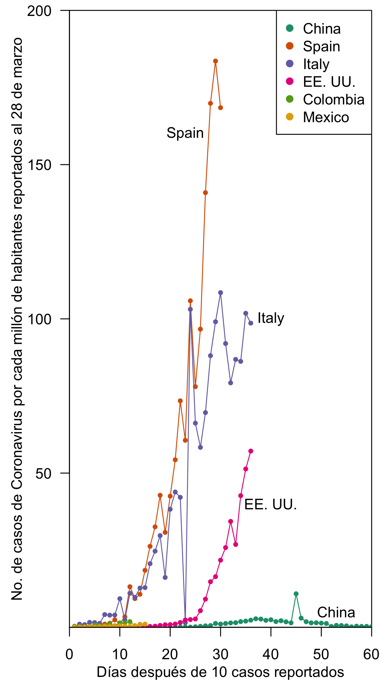
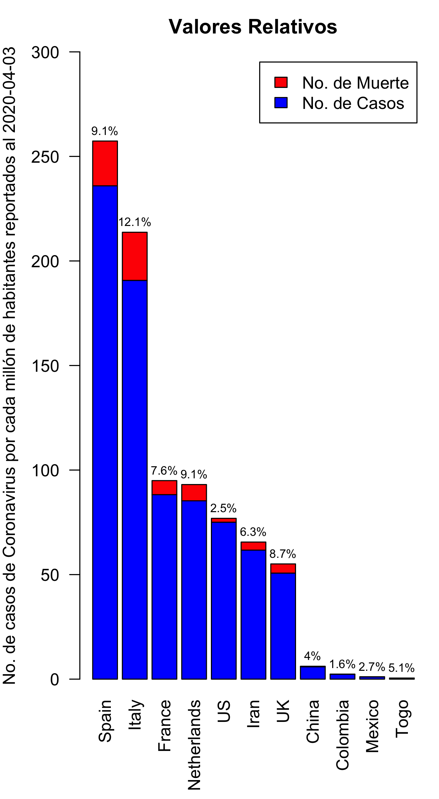

# COVID 19 - 2020
_April 2020_

This repository has the code and the results of the COVID-19 pandemic for some countries of interest up to 202.04.03. The data was downloaded from https://opendata.ecdc.europa.eu/covid19/casedistribution/csv and, the graphs take into account the population of each country (2018).

  
  

